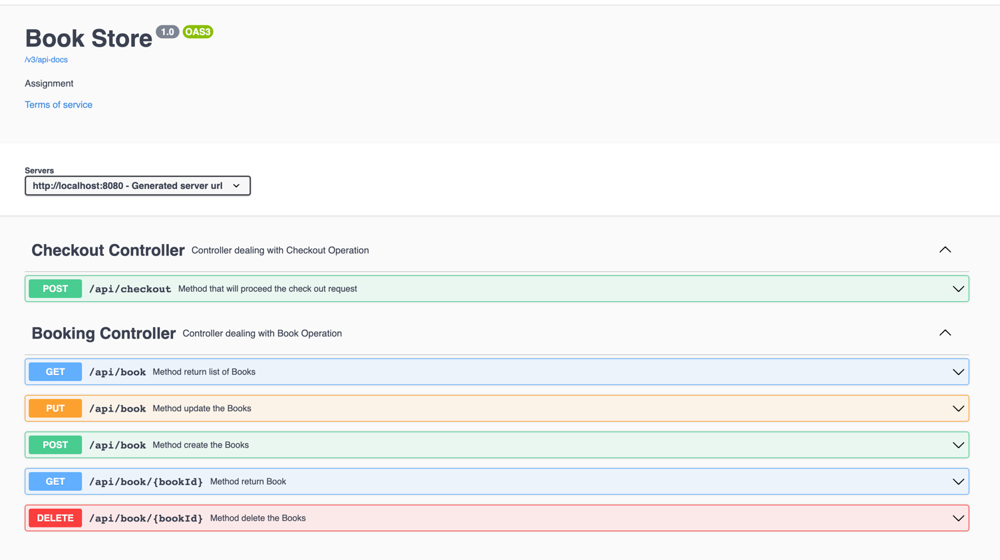
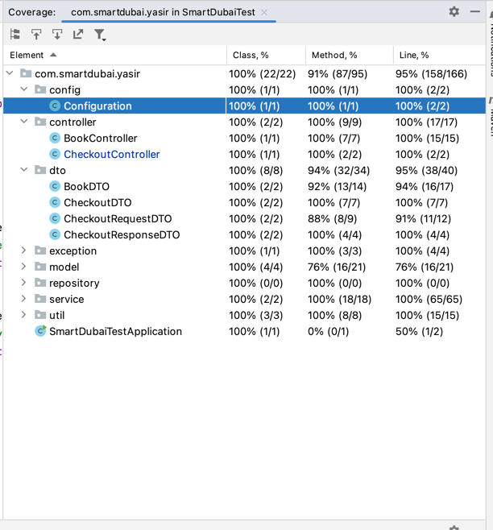

# Book Service

THis REST API for an online bookstore, where the user can perform the following operations:

- CRUD operations on Books
- Checkout operation for single or multiple books which will return the total payable amount.

### Project Description

In this Project we used following

- Spring Boot
- Java 17
- SpringData along with InMemoryDB
- SwaggerUI
- Lombok
- Docker

## Requirements

- Java Development Kit (JDK) 11 or higher
- Apache Maven
- cURL or an API testing tool (e.g., Postman)

## Getting Started

Clone the repository:

   ```bash
   git clone https://github.com/yasirshabbir44/book-checkout-service.git
```
   


## Running the application through terminal

You can run your application in terminal
```shell script
./mvnw spring-boot:run
```


### Run through Docker

First go to Project path through Terminal and run this command

```
$> docker build --tag=smart-dubai-test:latest .

$> docker run -p8887:8888 smart-dubai-test:latest
```

### Promo Code

- VISA 10%
- SMART 20%


##  SwaggerUI

`http://localhost:8080/swagger-ui/index.html`




#####  Test Coverage 

By test cases mostly more than 90% code is covered through test cases

