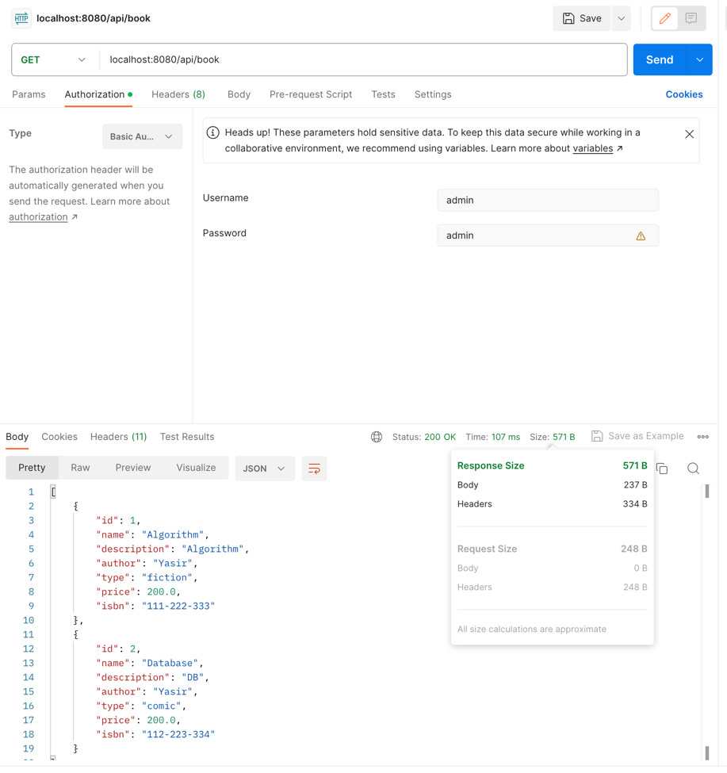
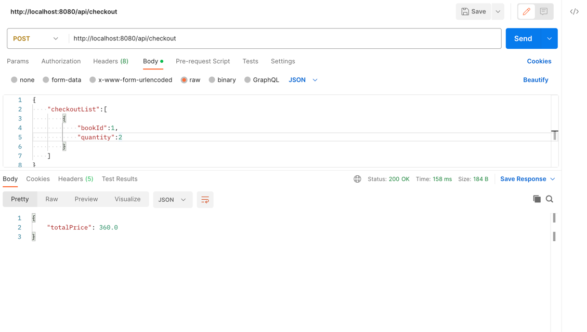
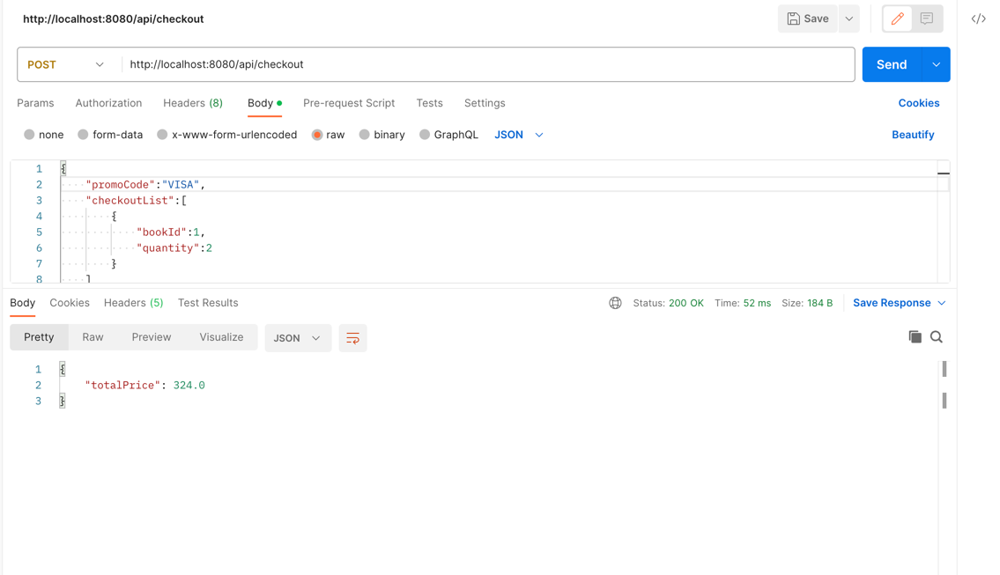

# Book Service

THis REST API for an online bookstore, where the user can perform the following operations:

- CRUD operations on Books
- Checkout operation for single or multiple books which will return the total payable amount.
Also introduced the Basic Security level also to protect the API rather than accessing directly.


### Project Description

In this Project we used following

- Spring Boot
- Java 17
- SpringData along with InMemoryDB
- SwaggerUI
- Lombok
- Docker
- Spring Security
- BCrypt Encoding for Password

## Requirements

- Java Development Kit (JDK) 11 or higher
- Apache Maven
- cURL or an API testing tool (e.g., Postman)

### Default User & Password
username : admin

password : admin


## Getting Started

Clone the repository:

   ```bash
   git clone https://github.com/yasirshabbir44/book-checkout-service.git
```
   


## Running the application through terminal

You can run your application in terminal
```shell script
mvn spring-boot:run
```


### Run through Docker

First go to Project path through Terminal and run this command

```shell script
docker build --tag=smart-dubai-test:latest .
```
```shell script
docker run -p8887:8888 smart-dubai-test:latest
```
## Endpoints
The following RESTful endpoints are available:

#### Book

* GET /api/book - Retrieve a list of all book.
* GET /api/book/{id} - Retrieve a specific book by ID.
* POST /api/book - Create a new book.
* PUT /api/book - Update an existing book.
* DELETE /api/book/{id} - Delete a book.


#### Checkout
* POST /api/checkout - For Checkout


### Promo Code

- VISA 10%
- SMART 20%


##  SwaggerUI

`http://localhost:8080/swagger-ui/index.html`


#####  Test Coverage

By test cases mostly more than 90% code is covered through test cases


### Postman Sample call
* List of all available Book

  `curl --location 'localhost:8080/api/book' \
  --header 'Authorization: Basic YWRtaW46YWRtaW4='
  `

  


* Checkout without promo code

  `curl --location 'http://localhost:8080/api/checkout' \
  --header 'Content-Type: application/json' \
  --header 'Authorization: Basic YWRtaW46YWRtaW4=' \
  --data '{
  "checkoutList":[
  {
  "bookId":1,
  "quantity":2
  }
  ]
  }'
  `
  

* Checkout with Promo code

  `curl --location 'http://localhost:8080/api/checkout' \
  --header 'Content-Type: application/json' \
  --header 'Authorization: Basic YWRtaW46YWRtaW4=' \
  --data '{
  "promoCode":"VISA",
  "checkoutList":[
  {
  "bookId":1,
  "quantity":2
  }
  ]
  }'
  `
  

